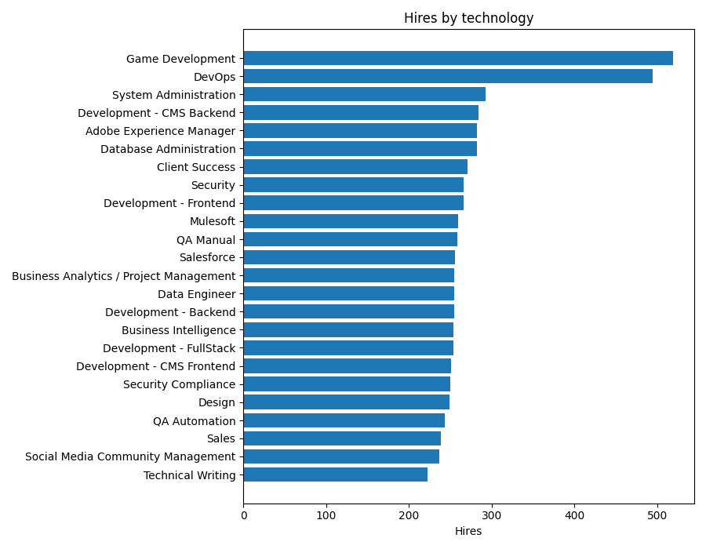
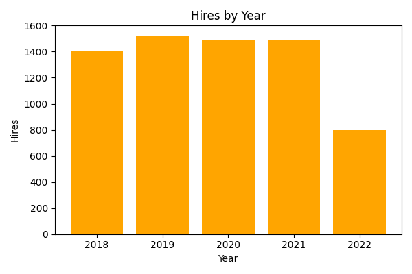
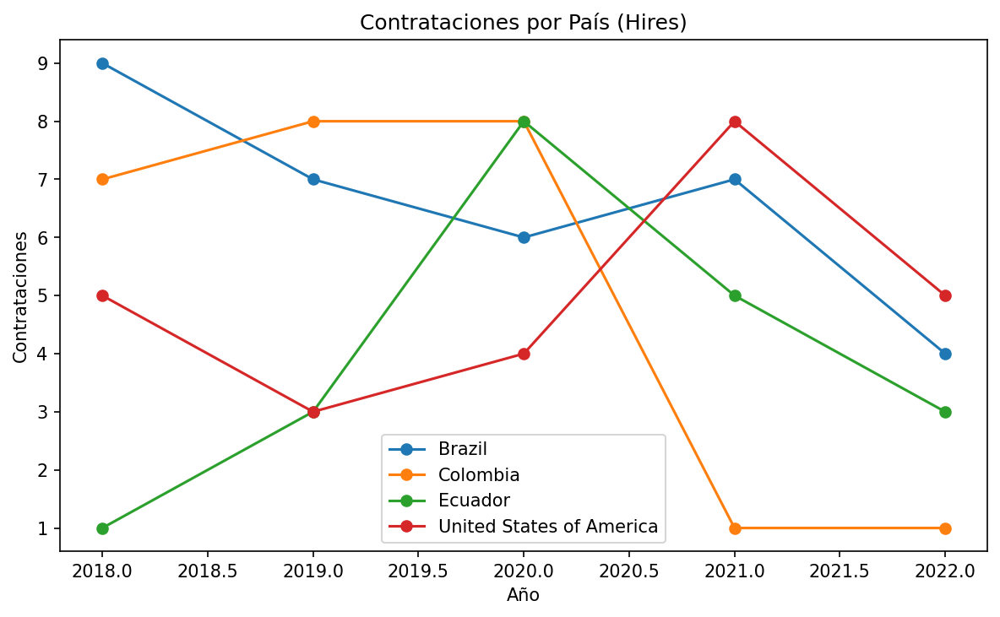
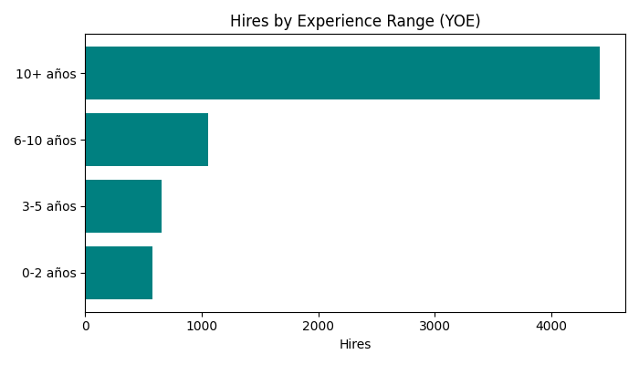
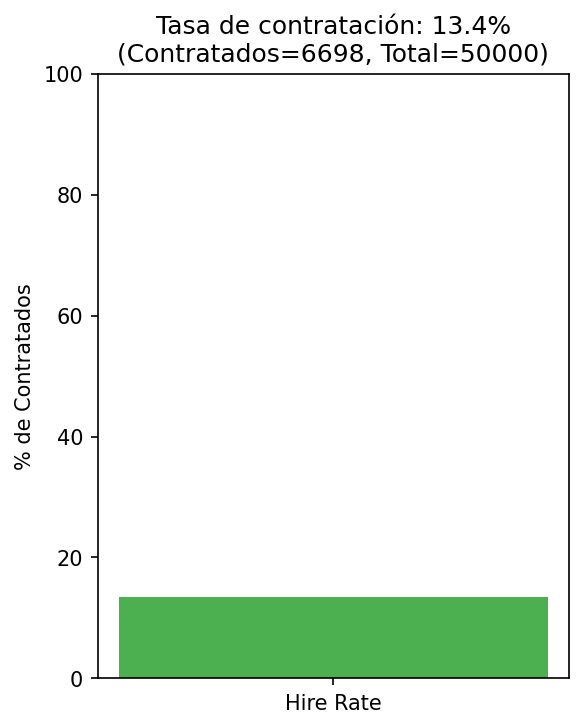

# ETL Workshop Project – Candidate Selection


## 📌 Description
This project implements an **end-to-end ETL pipeline** for a dataset of job candidates in the tech industry.  
The goal was to design a **Data Warehouse in MySQL** using a **star schema dimensional model**, and from it compute key **recruitment KPIs** and create **visualizations in Python (Matplotlib)**.

⚠️ All analysis and reports are generated directly from the **Data Warehouse**, not from the raw CSV file.

---

## 🚀 Project Workflow
1. **Extract**  
   Load raw candidate data from `candidates.csv` (~50k rows).  

2. **Transform**  
   - Build clean dimension tables (`date`, `country`, `technology`, `seniority`, `candidate`).  
   - Define the field `hired`:  
     ```text
     hired = 1 if (code_challenge_score >= 7 AND interview_score >= 7), else 0
     ```  

3. **Load**  
   Insert all dimensions and the fact table (`fact_selection`) into MySQL Workbench (database `selection_dw`).  

4. **Analyze**  
   Query the Data Warehouse and generate recruitment KPIs. Results are exported to Python and visualized with Matplotlib.

---

## 🗄️ Dimensional Model
**Fact Table**: `fact_selection`  
- Measures: `code_challenge_score`, `interview_score`, `hired (0/1)`  
- Foreign Keys: `date_id`, `candidate_id`, `country_id`, `technology_id`, `seniority_id`

**Dimension Tables**:  
- `dim_date (date_id, full_date, year, month)`  
- `dim_candidate (candidate_id, first_name, last_name, email, yoe)`  
- `dim_country (country_id, country)`  
- `dim_technology (technology_id, technology)`  
- `dim_seniority (seniority_id, seniority)`  

This star schema design makes queries fast and keeps the model simple for BI use cases.

---

## 📊 KPIs
A total of **six KPIs** were developed:

### Required KPIs
1. **Hires by Technology**  
   → Which technologies have the highest number of hires.  

2. **Hires by Year**  
   → Hiring trends over time.  

3. **Hires by Seniority**  
   → Which levels (Junior, Mid-level, Senior) are most often hired.  

4. **Hires by Country over Years**  
   → Focus on USA, Brazil, Colombia, and Ecuador.  

### Additional KPIs
5. **Hires by Experience Range (YOE buckets)**  
   → Distribution of hires by years of experience: 0–2, 3–5, 6–10, 10+.  

6. **Hire Rate**  
   → Recruitment efficiency:  
   \[
   HireRate = \frac{\text{Total Hired}}{\text{Total Applications}}
   \]

---

## 📈 Visualizations
The KPIs were visualized using **Matplotlib**, with direct SQL queries executed via **SQLAlchemy**.  

Examples:  
- Horizontal bar chart → hires by technology.  
- Vertical bar chart → hires by year.  
- Line chart → hires by country over time.  
- Bar chart → hires by experience and seniority.  
- Single bar chart → global hire rate.  

All generated figures are stored in the `/figs` folder and can be included in reports or presentations.  

### Hires by Technology


### Hires by Year


### Hires by Seniority


### Hires by Country


### Hires by Experience Range


### Hire Rate


---

## ⚙️ Requirements
- Python 3.10+  
- Libraries: `pandas`, `sqlalchemy`, `pymysql`, `matplotlib`  
- MySQL Workbench 8.0 with the database `selection_dw`  

Install dependencies with:
```bash
pip install -r requirements.txt
