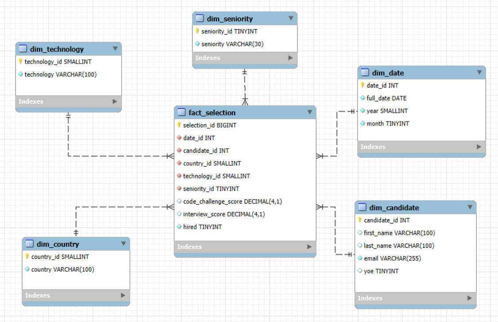
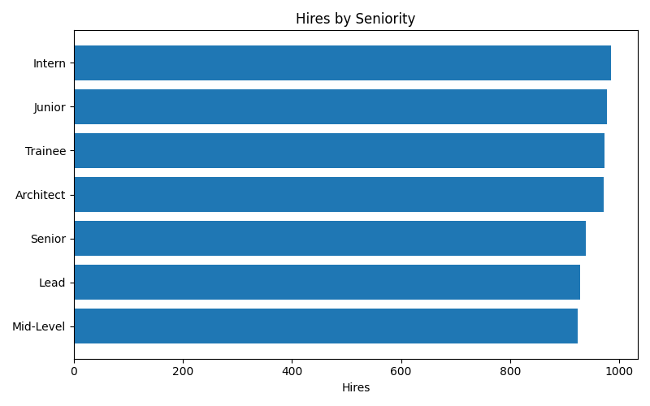
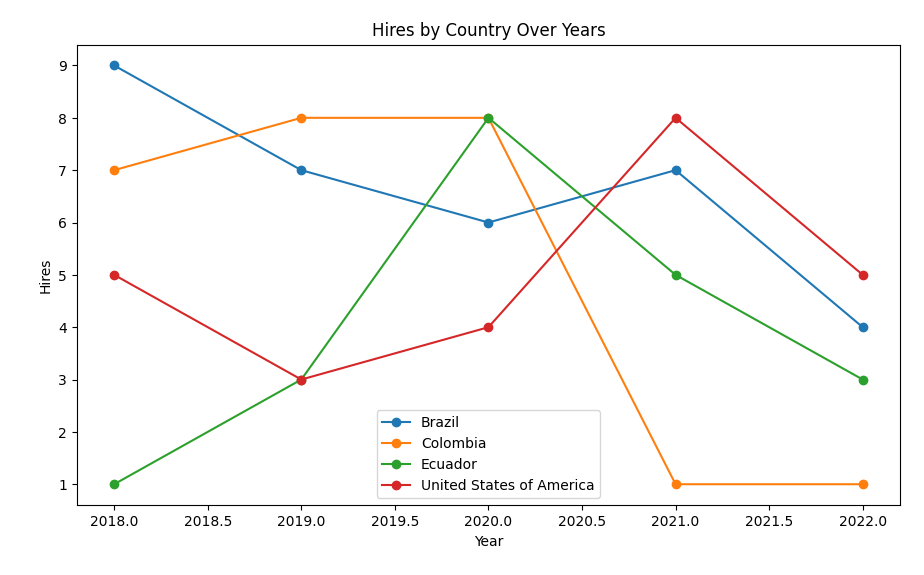

# 🚀 ETL Workshop Project – Candidate Selection


---

## 📌 Description
This project implements an **end-to-end ETL pipeline** for a dataset of job candidates in the tech industry.  
The goal was to design a **Data Warehouse in MySQL** using a **star schema dimensional model**, and from it compute key **recruitment KPIs** and create **visualizations in Python (Matplotlib)**.

⚠️ All analysis and reports are generated directly from the **Data Warehouse**, not from the raw CSV file.

---

## 🔄 Project Workflow
1. **Extract** → Load raw candidate data from `candidates.csv` (~50k rows).  
2. **Transform** →  
   - Build clean dimension tables (`date`, `country`, `technology`, `seniority`, `candidate`).  
   - Define the field `hired`:  
     ```text
     hired = 1 if (code_challenge_score >= 7 AND interview_score >= 7), else 0
     ```  
3. **Load** → Insert all dimensions and the fact table (`fact_selection`) into MySQL Workbench (`selection_dw`).  
4. **Analyze** → Query the DW and generate recruitment KPIs. Results are exported to Python and visualized with Matplotlib.  

---

## 🗄️ Dimensional Model

Here is the star schema used in the project:



**Fact Table**: `fact_selection`  
- Measures: `code_challenge_score`, `interview_score`, `hired (0/1)`  
- Foreign Keys: `date_id`, `candidate_id`, `country_id`, `technology_id`, `seniority_id`

**Dimension Tables**:  
- `dim_date (date_id, full_date, year, month)`  
- `dim_candidate (candidate_id, first_name, last_name, email, yoe)`  
- `dim_country (country_id, country)`  
- `dim_technology (technology_id, technology)`  
- `dim_seniority (seniority_id, seniority)`  

✨ This **star schema** design makes queries fast and keeps the model simple for BI use cases.

---

## 📊 KPIs
A total of **six KPIs** were developed:

### ✅ Required KPIs
1. **Hires by Technology** → Which technologies have the highest number of hires.  
2. **Hires by Year** → Hiring trends over time.  
3. **Hires by Seniority** → Which levels (Junior, Mid-level, Senior) are most often hired.  
4. **Hires by Country over Years** → Focus on USA, Brazil, Colombia, and Ecuador.  

### ➕ Additional KPIs
5. **Hires by Experience Range (YOE buckets)** → Distribution of hires by years of experience: 0–2, 3–5, 6–10, 10+.  
6. **Hire Rate** → Recruitment efficiency:  
   \[
   HireRate = \frac{\text{Total Hired}}{\text{Total Applications}}
   \]

---

## 📈 Visualizations
The KPIs were visualized using **Matplotlib**, with direct SQL queries executed via **SQLAlchemy**.  

Examples:  
- 📊 Horizontal bar → hires by technology  
- 📊 Vertical bar → hires by year  
- 📈 Line chart → hires by country  
- 📊 Bar chart → hires by experience & seniority  
- 📉 Single bar → global hire rate  

All generated figures are stored in the `/figs` folder.  

### Hires by Technology


### Hires by Year


### Hires by Seniority


### Hires by Country


### Hires by Experience Range


### Hire Rate


---

## ⚙️ Requirements
- Python 3.10+  
- Libraries: `pandas`, `sqlalchemy`, `pymysql`, `matplotlib`  
- MySQL Workbench 8.0 with the database `selection_dw`  

Install dependencies with:
```bash
pip install -r requirements.txt

## ▶️ How to Run
1. Clone the repository:
   git clone https://github.com/fabiaangzc/etl-workshop-candidate-selection.git
   cd etl-workshop-candidate-selection

2. Configure your MySQL credentials in db_conn.py

3. Run the ETL process:
   python etl.py

4. Generate KPIs and visualizations:
   python kpis.py

